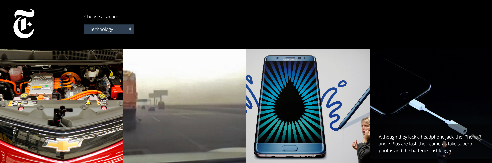

#Project 2: The Instanews App Project
Project 2 at RED introduced us to the world of JSON and Ajax calls to dynamically load content into our page through the use of the New York Times API.

##About the Instanews Site
Instanews is a single page mock news site which dynamically grabs news articles from the NYT API organized by section.

###Technology Used
* HTML5
* SASS/CSS3
* jQuery
* Ajax/JSON 
* Gulp as a Build tool
* GIT for version control

##Meaningful Takeaways
This project held a myriad of challenges and rewards to be found. Using new tools learned in class, I was able to add depth to my webpage, and increase the speed at which I am able to develop through the use of the Gulp build tool.

The instanews app project required us to hook into the New York Times API using the .ajax() request method. Using this method in combination with other jQuery methods, I was able to pull out 12 top stories for a news section of choice, with some key pieces of associated information based off design mockups to produce a dynamic web layout.

Using jQuery was mostly a lot of trial and error, experimenting to find the right methods and functions to use, and when to use them. Keeping my brackets organized at least helped a bit. Google was a fantastic resource for helping out in a pinch, but getting to a place where the jQuery works, just feels so good!
